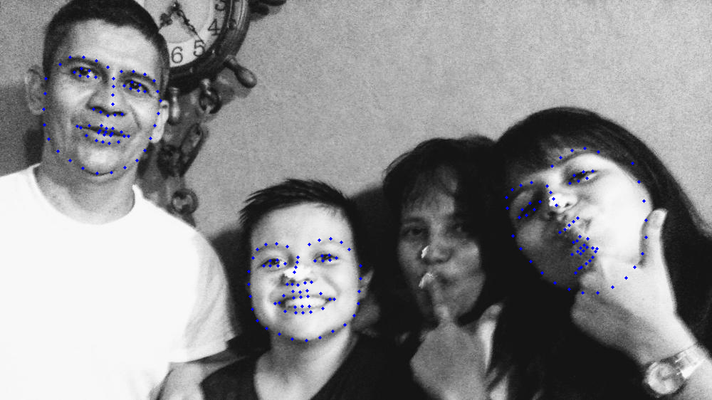

# facial-landmarks
Facial landmarks detection with old blurred photos test (2019)



## Installation
### Prerequisites
OpenCV and dlib:
```
pip install opencv-python
pip install dlib
```
### Install
Clone this repository:
```
git clone https://github.com/aletrujim/facial-landmarks.git FacialLandmarks
```

### Dataset
Facial point annotations from [ibug](https://ibug.doc.ic.ac.uk/resources/facial-point-annotations)

